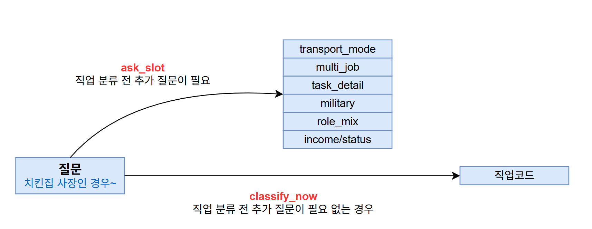

# 📦 job-test-public

직업 분류 챗봇 평가용 데이터셋과 실험 결과를 정리한 공개 저장소입니다.

이 페이지는 요약 페이지며, 세부적인 실험 결과는 `result/` 아래에 정리되어 있습니다.

<br>

## 📖 Task 정의



Task는 2가지입니다.

### 1. `ask_slots`

직업 분류 전에 추가 질문이 필요한 케이스를 골라내고, 상황에 맞는 추가 질의 slot을 제시합니다.

ex) 본사 데이터 예시 (직업 분류 전 추가 질문이 필요한 경우)
| 질문 | truth_슬롯 |
|------|-----------|
| 치킨집 사장인 경우 음식도 만들고 이륜차로 배달도 하는데 이런 경우에는 직업을 주방장 또는 배달업 중 무엇으로 적용해야 하나요? | transport_mode |
| 평일에는 회사원이었다가, 주말에 잠깐 배달알바를 하는데 이 경우 배달원으로 넣어야 하는게 맞나요? | multi_job |
| 학생인데 선수등록이 되어 있어. 그럼 직업은 뭘로 하지? | task_detail |

- slot 종류: `transport_mode`, `multi_job`, `task_detail`, `military`, `role_mix`, `income/status`

###  2. `classify_now`

고객이 자연어로 설명한 직업/상황을 보고 적절한 `job_code`를 바로 분류하는 성능을 평가합니다.

ex) 본사 데이터 예시 (직업 분류 전 추가 질문이 필요 없는 경우)
| 질문 | truth_직업코드 | truth_직업명 |
|------|---------------|-------------|
| 건물에서 청소를 하시는 분이 평소 건물 내부를 청소하다가 분기에 1번 정도 옥상 물청소를 하는데 이 경우, 건물 내부청소원으로 해야하는지, 아니면 외부청소원으로 넣어야 하는지 문의드립니다. | 94112 | 건물외부 청소원 |
| 70세인 어머니가 홀로 생활하시는데, 고령으로 일하진 않고 집에서 살림만 하고 계시면 가정주부로 가입해도 되는지 문의드립니다. | B3200 | 전업주부 |
| 공장장으로 평소에는 작업 진행 관리, 직원 관리를 하다가 1년에 1번정도 신입사원이 들어오면 직접 기계를 어떻게 조작을 하는지 알려줄 때가 있는데, 이때 직업을 어떻게 넣어야 하는지 궁금합니다. | 16011 | 그 외 제품생산관련업체 현장관리자 |

<br>

## 📄 결과 요약

### `ask_slots`

| 세트 | 폴더명 | 실험 설명 | 대표 점수 |
|---|---|---|---|
| A | `A_ask_slots` | 본사 데이터 | 90.4% (`conditional slot accuracy`) |
| B | `B_ask_slots` | 본사 데이터 few-shot 기반 유사 데이터 생성 | 69.6% (`conditional slot accuracy`, Claude)<br>79.6% (`conditional slot accuracy`, Gemini)|

> `conditional slot accuracy`는 "바로 `job_code`로 분류되지 않고, 재질의가 필요하다고 안내된 케이스 중 실제 slot 종류까지 정확히 맞췄는가"를 보는 지표입니다.

### `classify_now`

| 세트 | 폴더명 | 실험 설명 | 대표 점수 |
|---|---|---|---|
| A | `A_job_classify_now` | 본사 데이터 | 95.76% (`Recall@5`) |
| B | `B_job_classify_now` | 직업코드 설명 기반 데이터 생성 | 98.64% (재검증 반영 최종 `Recall@5`, Claude) |
| C | `C_job_classify_now` | 직업코드 설명 기반 복수직업 데이터 생성 | 94.19% (재검증 반영 최종 `Recall@5`) |
| D | `D_job_classify_now` | 본사 데이터 few-shot 기반 유사 데이터 생성 | 92.32% (재검증 반영 최종 `Recall@5`) |
| E | `E_job_classify_now` | 본사 데이터 few-shot + 직업코드 설명 기반 데이터 생성 | 97.70% (재검증 반영 최종 `Recall@5`, Claude)<br>94.04% (재검증 반영 최종 `Recall@5`, Gemini) |
> 재검증 반영: GPT-5.4, Human 기반으로 평가 제대로 되었는지 재확인

<br>

## 📁 저장소 구조

```text
job-test-public/
├── README.md
└── result/
    ├── ask_slots/
    │   ├── A_ask_slots/                         # 본사 데이터
    │   │   ├── questions.jsonl
    │   │   ├── eval_results.jsonl
    │   │   └── eval_results.txt
    │   └── B_ask_slots/                        # 본사 데이터 few-shot 기반 유사 데이터 생성
    │       ├── claude/
    │       │   ├── questions.jsonl
    │       │   ├── eval_results.jsonl
    │       │   └── eval_results.txt
    │       └── gemini/
    │           ├── questions.jsonl
    │           ├── eval_results.jsonl
    │           └── eval_results.txt
    ├── classify_now/
    │   ├── A_job_classify_now/                 # 본사 데이터
    │   │   ├── questions.jsonl
    │   │   └── eval_results_20260415_181654.txt
    │   ├── B_job_classify_now/                 # 직업코드 설명 기반 생성 데이터
    │   │   └── claude/
    │   │       ├── B_all_questions.jsonl
    │   │       ├── eval_result_20260420_174639.txt
    │   │       └── verify_result_20260421_132737.txt
    │   ├── C_job_classify_now/                 # 복수 직업 질의 생성 데이터
    │   │   ├── questions.jsonl
    │   │   ├── eval_result_20260421_140026.txt
    │   │   └── verify_result_20260421_145812.txt
    │   ├── D_job_classify_now/                 # few-shot 기반 유사 데이터 생성
    │   │   ├── questions.jsonl
    │   │   ├── eval_results_20260416_092643.txt
    │   │   └── verify_result_20260421_133643.txt
    │   └── E_job_classify_now/                 # 본사 데이터 few_shot + 직업코드 설명 기반 생성 데이터
    │       ├── claude/
    │       │   ├── questions_claude.jsonl
    │       │   ├── eval_result_20260420_145852_claude.txt
    │       │   └── verify_result_20260421_133016_claude.txt
    │       └── gemini/
    │           ├── questions_gemini.jsonl
    │           ├── eval_result_20260420_160521_gemini.txt
    │           └── verify_result_20260421_133127_gemini.txt
    └── compare_llm_models/
        ├── README.md                           # 모델별 결과 비교
        └── google_models_limit.png             # Google 계열 모델 비교 이미지
```

<br>

## 🚀 모델 비교 자료

`result/compare_llm_models/README.md`에는 6개의 LLM으로 질문을 생성하고 품질을 비교한 예시가 정리되어 있습니다.

- 비교 대상: `gpt-5.4`, `gpt-5-mini`, `sonnet-4.6`, `opus-4.6`, `gemini-3.0-flash`, `gemini-3.1-pro`
- 결론 요약: 사람과 가장 유사한 품질을 보여준 `sonnet-4.6`을 우선 선택했고, 일부 task에서는 `gemini-3.0-flash`도 병행 사용했습니다.

<br>

## 🗂️ 질의 생성 시 사용한 직업코드 데이터

| job_code | job_name | risk_grade | description | examples |
|----------|----------|------------|-------------|----------|
| 11104 | 공무원(5급 이상)(현장, 기능업무 수행자) | A | 국가공무원법 또는 지방공무원법 등에 정한 공무원 중 5급 이상 공무원을 말하며, 현장, 기능업무 수행자에 한하여 적용한다.- 현장, 기능업무 수행자는 사무업무를 수행하지 않거나 현장관리, 검사, 감독 등 대부분의 업무를 사무실이 아닌 곳에서 수행하는 자를 말한다. | 토목사무관, 건축사무관, 기계사무관, 전기전자사무관, 환경사무관, 의무사무관(의사), 수의사무관, 약무사무관(약사), 재난안전사무관, 산림사무관, 농업사무관 |

<br>

## 🧠 핵심 산출물 상세

### 1. `result/ask_slots/`

직업 분류 전에 추가 질문이 필요한 케이스를 골라내고,
각 상황에 맞는 추가 질의 종류(slot)를 제시합니다.

즉, "바로 분류할 수 있는가"가 아니라
"추가 질문이 필요한가, 필요하다면 어떤 slot인가"를 평가한 자료입니다.


### A. `A_ask_slots/`

- 실제 본사 데이터입니다.
- 데이터 건수: `questions.jsonl` 132건
- 실험 결과 파일: `eval_results.txt`

| ask accuracy | overall slot accuracy | conditional slot accuracy |
|---:|---:|---:|
| 94.7% | 85.6% | `90.4% (125건)` |

각 지표의 의미는 아래와 같습니다.

- `ask accuracy`: 추가 질문이 필요한 케이스를 놓치지 않고 잡아낸 비율입니다. 즉, "재질의가 필요하다"고 정답 라벨이 붙은 케이스 중 모델이 실제로 재질의가 필요하다고 판단한 비율입니다.
- `overall slot accuracy`: 전체 데이터 기준으로 slot 종류까지 정확히 맞춘 비율입니다. 재질의가 필요 없다고 잘못 판단한 케이스도 오답으로 포함됩니다.
- `conditional slot accuracy`: 모델이 "재질의가 필요하다"고 판단한 케이스 중 실제 slot 종류까지 정확히 맞춘 비율입니다.

이 중 `conditional slot accuracy`는
"바로 job_code로 분류되지 않고, 재질의가 필요하다고 안내된 케이스 중
실제 slot까지 정확히 맞췄는가"를 보는 지표라서
가장 중요하게 해석했습니다.

### B. `B_ask_slots/claude`, `B_ask_slots/gemini`

- 본사 데이터 일부를 예시로 주고, 유사 데이터를 생성했습니다.
- 질의 생성 모델: `claude-sonnet-4-6`, `gemini-3.0-flash`
- 데이터 건수
  - `B_ask_slots/claude/questions.jsonl`: 387건
  - `B_ask_slots/gemini/questions.jsonl`: 396건

<details>
<summary>📝 데이터 생성에 사용한 프롬프트</summary>

```text
당신은 보험 직업코드 분류 시스템의 RAG 평가 데이터셋을 만드는 전문가입니다.

아래 태스크 카테고리와 예시 질문들을 참고하여, 비슷한 성격·난이도의 새로운 한국어 질문을 {n}개 생성하세요.

[태스크] {task}
[설명] {desc}

[Few-shot 예시]
{shots}

요구사항:
- 예시와 중복되지 않는 새로운 상황/직업을 다룰 것
- 실제 상담 현장에서 나올법한 자연스러운 말투
- 각 질문은 한 줄로 작성
- 가능한 질문을 알아듣기 쉽고 짧게 생성할 것
- 번호나 불릿 없이, 질문만 줄바꿈으로 구분하여 출력
- 설명이나 머리말 없이 질문 {n}개만 출력
```

변수 설명:
- `{n}`: 생성할 질문 개수
- `{task}`: 태스크 카테고리명 (예: `transport_mode`, `multi_job` 등)
- `{desc}`: 해당 태스크에 대한 설명
- `{shots}`: few-shot 예시로 사용한 본사 데이터

</details>

Claude 실험 결과:

| ask accuracy | overall slot accuracy | conditional slot accuracy |
|---:|---:|---:|
| 23.8% | 16.5% | `69.6% (92건)` |

Gemini 실험 결과:

| ask accuracy | overall slot accuracy | conditional slot accuracy |
|---:|---:|---:|
| 18.4% | 14.6% | `79.5% (73건)` |

<br>

## 2. `result/classify_now/`

추가 재질의 없이 바로 직업코드로 분류할 수 있는지를 평가한 자료입니다.
즉, 고객 발화를 보고 적절한 `job_code`를 후보 상위권에 얼마나 잘 올리는지를 확인합니다.

### A. `A_job_classify_now/`

- 실제 본사 데이터입니다.
- 데이터 건수: `questions.jsonl` 165건
- 실험 결과 파일: `eval_results_20260415_181654.txt`

| Recall@1 | Recall@3 | Recall@5 | Recall@10 | MRR@3 | MRR@5 | MRR@10 |
|---:|---:|---:|---:|---:|---:|---:|
| 65.45% | `92.73%` | 95.76% | 98.18% | 0.7737 | 0.7804 | 0.7844 |

### B. `B_job_classify_now/claude`

- 직업코드 설명을 예시로 주고, 각 직업코드에 대응하는 질의를 생성했습니다.
- 질의 생성 모델: `claude-sonnet-4-6`
- 데이터 건수: `B_all_questions.jsonl` 738건
- 임의 RAG를 사용하여 질문과 가장 유사한 직업코드가 Ground Truth가 맞는지 검증했습니다.
- 실험 결과 파일: `eval_result_20260420_174639.txt`
- 실험 후, 오답에 대해서 `gpt-5.4`를 사용해 Ground Truth와 예측값(직업급수서비스) 중 무엇이 더 정답에 가까운지 검증했습니다.

| Recall@1 | Recall@3 | Recall@5 | Recall@10 | MRR@1 | MRR@3 | MRR@5 | MRR@10 |
|---:|---:|---:|---:|---:|---:|---:|---:|
| 92.14% | `97.97%` | 98.24% | 98.37% | 0.9214 | 0.9487 | 0.9494 | 0.9496 |

재검증(`verify_result_20260421_132737.txt`) 결과, 검증 대상 58건 중 GT가 맞다고 판단된 케이스는 54건, Pred가 맞다고 판단된 케이스는 4건입니다. 재계산된 점수는 아래와 같습니다.

| Recall@1 | Recall@3 | Recall@5 | Recall@10 |
|---:|---:|---:|---:|
| 92.68% | `98.37%` | 98.64% | 98.64% |

### C. `C_job_classify_now/`

- 직업코드 설명 2개를 예시로 주고, 복수 직업을 가진 사람의 질의를 생성했습니다.
- 질의 생성 모델: `claude-sonnet-4-6`
- 데이터 건수: `questions.jsonl` 86건
- `job_code`는 문자열 하나일 수도 있고 배열일 수도 있습니다.
- 직업 등급이 다른 경우에는 등급이 낮은 문자열 하나를 사용했고, 직업 등급이 같은 경우에는 배열에 직업코드를 모두 포함시켰습니다.
- 임의 RAG를 사용하여 질문과 가장 유사한 직업코드가 Ground Truth가 맞는지 검증했습니다.
- 실험 결과 파일: `eval_result_20260421_140026.txt`

| Recall@1 | Recall@3 | Recall@5 | Recall@10 | MRR@3 | MRR@5 | MRR@10 |
|---:|---:|---:|---:|---:|---:|---:|
| 52.33% | `91.86%` | 94.19% | 94.19% | 0.7093 | 0.7145 | 0.7145 |

재검증(`verify_result_20260421_145812.txt`) 결과, 검증 대상 41건 중 GT가 맞다고 판단된 케이스는 26건, Pred가 맞다고 판단된 케이스는 15건입니다. 단, Pred로 판정된 15건 중 `2_code`(정답 배열)에 포함되는 14건은 실제로는 정답 배열 내 다른 코드를 맞힌 것이므로 원래 순위를 유지합니다. 재계산된 점수는 아래와 같습니다.

| Recall@1 | Recall@3 | Recall@5 | Recall@10 |
|---:|---:|---:|---:|
| 53.49% | `91.86%` | 94.19% | 94.19% |

### D. `D_job_classify_now/`

- 본사 데이터 일부를 예시로 주고, few-shot 방식으로 유사 데이터를 생성했습니다.
- 질의 생성 모델: `gemini-3.0-flash`
- Ground Truth `job_code`는 임의 RAG 기반으로 생성되어 일부 부정확한 데이터가 포함되었을 가능성이 있습니다.
- 데이터 건수: `questions.jsonl` 495건
- 실험 결과 파일: `eval_results_20260416_092643.txt`

| Recall@1 | Recall@3 | Recall@5 | Recall@10 | MRR@3 | MRR@5 | MRR@10 |
|---:|---:|---:|---:|---:|---:|---:|
| 43.23% | `66.06%` | 75.15% | 81.41% | 0.5350 | 0.5558 | 0.5650 |

재검증(`verify_result_20260421_133643.txt`) 결과, 검증 대상 281건 중 GT가 맞다고 판단된 케이스는 122건, Pred가 맞다고 판단된 케이스는 159건입니다. 재계산된 점수는 아래와 같습니다.

| Recall@1 | Recall@3 | Recall@5 | Recall@10 |
|---:|---:|---:|---:|
| 75.35% | `88.08%` | 92.32% | 93.94% |

> Ground Truth 값을 명확하게 파악하기가 어려워, 정확한 측정이 어렵습니다.

### E. `E_job_classify_now/claude`, `E_job_classify_now/gemini`

- 본사 데이터와 직업코드 설명을 함께 예시로 주고, 각 직업코드에 대응하는 질의를 생성했습니다.
- 질의 생성 모델: `claude-sonnet-4-6`, `gemini-3.0-flash`
- 데이터 건수는 아래와 같습니다.
  - `E_job_classify_now/claude/questions_claude.jsonl`: 738건
  - `E_job_classify_now/gemini/questions_gemini.jsonl`: 738건
- 실험 후, 오답에 대해서 `gpt-5.4`를 사용해 Ground Truth와 예측값(직업급수서비스) 중 무엇이 더 정답에 가까운지 검증했습니다.

Claude 실험 결과 (`eval_result_20260420_145852_claude.txt`):

| Recall@1 | Recall@3 | Recall@5 | Recall@10 | MRR@3 | MRR@5 | MRR@10 |
|---:|---:|---:|---:|---:|---:|---:|
| 86.99% | `97.15%` | 97.56% | 97.70% | 0.9178 | 0.9187 | 0.9190 |

재검증(`verify_result_20260421_133016_claude.txt`) 결과, 검증 대상 96건 중 GT가 맞다고 판단된 케이스는 91건, Pred가 맞다고 판단된 케이스는 5건입니다. 재계산된 점수는 아래와 같습니다.

| Recall@1 | Recall@3 | Recall@5 | Recall@10 |
|---:|---:|---:|---:|
| 87.67% | `97.43%` | 97.70% | 97.83% |

Gemini 실험 결과 (`eval_result_20260420_160521_gemini.txt`):

| Recall@1 | Recall@3 | Recall@5 | Recall@10 | MRR@3 | MRR@5 | MRR@10 |
|---:|---:|---:|---:|---:|---:|---:|
| 81.03% | `92.01%` | 93.09% | 93.22% | 0.8625 | 0.8651 | 0.8653 |

재검증(`verify_result_20260421_133127_gemini.txt`) 결과, 검증 대상 140건 중 GT가 맞다고 판단된 케이스는 126건, Pred가 맞다고 판단된 케이스는 14건입니다. 재계산된 점수는 아래와 같습니다.

| Recall@1 | Recall@3 | Recall@5 | Recall@10 |
|---:|---:|---:|---:|
| 82.93% | `93.36%` | 94.04% | 94.17% |

<br>

## 📊 성능 로그 해석

### `classify_now/*/eval_results_*.txt`

직업 분류 실험 요약 파일입니다. 파일마다 지표 이름이 조금씩 다를 수 있지만 의미는 같습니다.

예시:

```text
평가 완료: 680/680건 (에러 0건)
Recall@1       : 645/680 = 94.85%
Recall@3       : 674/680 = 99.12%
Recall@5       : 676/680 = 99.41%
Recall@10      : 676/680 = 99.41%
MRR@5          : 0.9701
```

- `Recall@1`: 1순위 예측이 정답인 비율
- `Recall@N`: 정답이 상위 N개 후보 안에 포함된 비율
- `MRR@N`: 정답 순위의 역수 평균으로, 1에 가까울수록 좋습니다.
- 일부 파일에는 오분류 상세 내역이 이어서 기록됩니다.

### `classify_now/*/verify_results_*.txt`

오분류처럼 보인 케이스를 다시 검증하기 위해,
LLM에게 GT와 Pred 중 어느 직업코드가 더 타당한지 질의한 결과입니다.

- 사용 모델: `gpt-5.4`

예시:

```text
# 54 GT=25300(유치원 교사) Pred=24720(보육 교사) → GT
```

- `GT`: LLM 생성 데이터의 정답값
- `Pred`: 직업급수서비스가 예측한 값
- `→ GT`: LLM 생성 데이터 쪽이 더 타당하다고 재판정
- `→ Pred`: 직업급수서비스 예측값이 더 타당하다고 재판정

### `ask_slots/*/eval_results.txt`

추가 질문 필요 여부와 slot 분류 정확도를 요약한 파일입니다.

예시:

```text
total: 132
ask_followup rate (recall): 125/132 = 0.947
slot accuracy (overall):    113/132 = 0.856
slot accuracy | ask_followup: 113/125 = 0.904
```

- 로그의 `ask_followup rate (recall)`은 이 README에서 `Recall@1`로 통일해 표기했습니다.
- `Recall@1`: 추가 질문이 필요한 케이스를 놓치지 않고 잡아낸 비율
- `slot accuracy (overall)`: 전체 데이터 기준 slot 예측 정확도
- `slot accuracy | ask_followup`: 추가 질문이 필요하다고 판단한 케이스 중 slot 종류까지 맞춘 비율
- 이 문서에서는 `slot accuracy | ask_followup`, 즉 `conditional slot accuracy`를 가장 중요한 지표로 해석했습니다.

<br>

## ⚙️ 임의 RAG

Ground Truth `job_code`를 빠르게 추정하거나 생성 데이터를 1차 검증할 때,
아래와 같은 임의 RAG 파이프라인을 사용했습니다.

- 검색 방식: hybrid embedding (`dense 0.7 + sparse 0.3`)
- 1차 후보 추출: hybrid 검색으로 상위 10개 후보 추출
- 2차 정렬: reranker로 최종 순위 재정렬
- dense embedding 모델: `text-embedding-3-large`
- sparse embedding 방식: `Kiwi` 형태소 분석 기반 BM25
- reranker 모델: `dragonkue/bge-reranker-v2-m3-ko`
